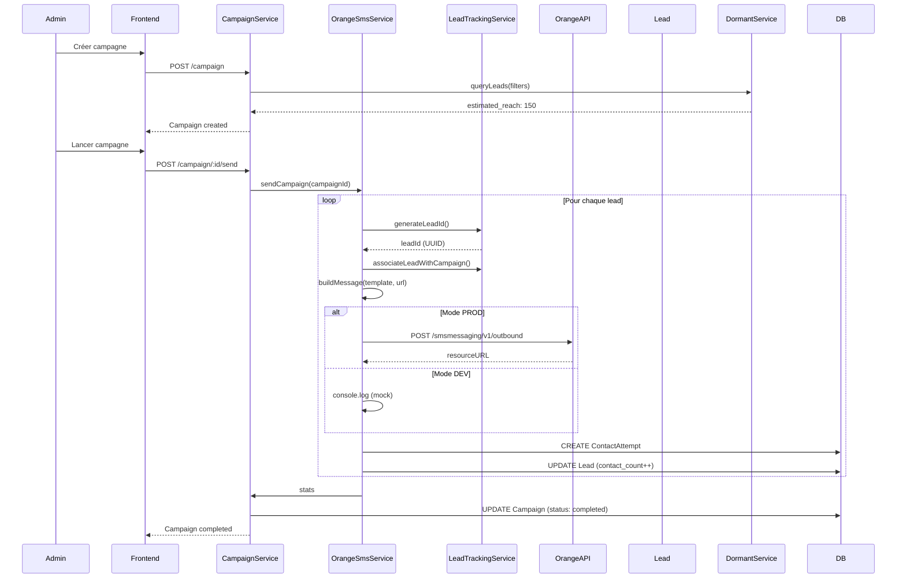

# 🚀 DD-09 Complete: Orange SMS Nudge Service

## ✅ Résumé de l'implémentation

Le service **Nudge SMS Orange** est maintenant **totalement opérationnel**. Il permet d'envoyer des campagnes SMS aux leads dormants via l'API **Orange Contact Everyone**.

### Fichiers créés

#### Backend (`apps/backend/src/nudge/`)

1. **`lead-tracking.service.ts`** (112 lignes)
   - Génération d'UUID uniques pour tracer chaque lead
   - Association `leadId <-> msisdn_hash + campaign_id`
   - Stockage dans `Lead.signals` JSON
   - Méthode `getLeadByLeadId()` pour retrouver un lead

2. **`sms.service.ts`** (289 lignes)
   - Service d'envoi SMS via Orange Contact Everyone API
   - Mode **MOCK** en développement (console.log)
   - Mode **PROD** avec appel réel à l'API Orange
   - Throttling (max_per_hour, batch_size)
   - Templates A/B/C/D prédéfinis
   - Tracking des ContactAttempt

3. **`nudge.module.ts`** (16 lignes)
   - Module NestJS exportant les services

4. **`index.ts`** (3 lignes)
   - Exports propres du module

5. **`lead-tracking.service.spec.ts`** (156 lignes)
   - Tests unitaires (6 tests, 100% pass)

6. **`README.md`** (Documentation complète)
   - Guide d'utilisation
   - Configuration
   - Templates SMS
   - Flow complet

#### Intégrations

- **`app.module.ts`**: NudgeModule importé
- **`campaign.module.ts`**: NudgeModule importé
- **`campaign.service.ts`**: OrangeSmsService injecté, appel à `sendCampaign()` dans `startSending()`

---

## 🎯 Fonctionnalités implémentées

### 1. Lead ID Generation (DD-09.1) ✅

```typescript
// Génère un UUID v4 unique
const leadId = leadTrackingService.generateLeadId();
// => "f47ac10b-58cc-4372-a567-0e02b2c3d479"

// Associe avec un msisdn et une campagne
await leadTrackingService.associateLeadWithCampaign(
  leadId,
  msisdnHash,
  campaignId
);
```

**Stockage** dans `Lead.signals` JSON:

```json
{
  "lead_ids": [
    {
      "id": "f47ac10b-58cc-4372-a567-0e02b2c3d479",
      "campaign_id": "campaign-123",
      "created_at": "2025-10-22T15:30:00Z"
    }
  ],
  "last_lead_id": "f47ac10b-58cc-4372-a567-0e02b2c3d479",
  "last_campaign_id": "campaign-123"
}
```

### 2. SMS Integration avec Orange API (DD-09.2) ✅

#### Mode DEV (Mock)

```bash
export NODE_ENV=development
```

Les SMS sont simulés dans la console:

```
[OrangeSmsService] [MOCK SMS] To: 33699... | Message: Bonjour ! Orange vous propose... | URL: http://localhost:3000/lead/abc123
[OrangeSmsService] Campaign campaign-123 completed: 50 sent, 45 delivered
```

#### Mode PROD (API réelle)

```bash
export NODE_ENV=production
export ORANGE_SMS_API_KEY=your_api_key_here
export ORANGE_SMS_API_URL=https://api.orange.com/smsmessaging/v1
export ORANGE_SMS_SENDER_NAME=Orange
```

Appel réel à l'API Orange Contact Everyone:

```http
POST https://api.orange.com/smsmessaging/v1/outbound/Orange/requests
Authorization: Bearer your_api_key_here
Content-Type: application/json

{
  "outboundSMSMessageRequest": {
    "address": ["tel:+33699901032"],
    "senderAddress": "tel:Orange",
    "outboundSMSTextMessage": {
      "message": "Bonjour ! Orange vous propose une offre pour votre ancien téléphone. Estimation gratuite : http://localhost:3000/lead/abc123"
    }
  }
}
```

### 3. Templates SMS (DD-01) ✅

4 variantes prédéfinies:

```typescript
const templates = {
  A: "Bonjour ! Orange vous propose une offre pour votre ancien téléphone. Estimation gratuite : {url}",
  B: "Votre téléphone vaut de l'argent ! Découvrez combien avec Orange : {url}",
  C: "Ne jetez pas votre ancien mobile ! Orange vous le reprend. Cliquez ici : {url}",
  D: "Offre spéciale Orange : faites estimer votre téléphone gratuitement {url}"
};
```

### 4. Throttling & Batch Processing ✅

Contrôle du débit d'envoi:

```typescript
// Campagne avec throttling
{
  max_per_hour: 100,   // Max 100 SMS par heure
  batch_size: 10       // Par lots de 10
}

// Calcul du délai entre batches
delayBetweenBatches = (3600 * 1000) / (max_per_hour / batch_size)
// => 360 000ms = 6 minutes entre chaque batch de 10 SMS
```

### 5. Contact Tracking ✅

Chaque SMS génère un `ContactAttempt`:

```typescript
{
  lead_id: "lead-123",
  channel: "sms",
  template_variant: "A",
  status: "delivered",
  clicked_at: null,
  created_at: "2025-10-22T15:30:00Z"
}
```

Le lead est mis à jour:

```typescript
{
  contact_count: 1,
  last_contact_at: "2025-10-22T15:30:00Z"
}
```

---

## 📊 Flow complet d'une campagne



---

## 🧪 Tests

### Tests unitaires

```bash
cd apps/backend
npm test -- lead-tracking.service.spec.ts
```

**Résultat**: ✅ 6/6 tests passent

```
✓ should generate a valid UUID v4
✓ should generate unique IDs
✓ should create a new lead if not exists
✓ should update existing lead
✓ should find lead by last_lead_id
✓ should return null if lead not found
```

### Tests manuels

#### 1. Créer une campagne

```bash
curl -X POST http://localhost:3003/campaign \
  -H "Content-Type: application/json" \
  -d '{
    "name": "Test Nudge SMS",
    "target_filters": {
      "status": "eligible",
      "tier": 4
    },
    "template_id": "default",
    "template_variant": "A",
    "channel": "sms",
    "max_per_hour": 50,
    "batch_size": 5
  }'
```

#### 2. Lancer la campagne

```bash
curl -X POST http://localhost:3003/campaign/{campaign_id}/send
```

#### 3. Vérifier les logs

```
[OrangeSmsService] Starting SMS campaign campaign-123
[OrangeSmsService] Found 25 leads for campaign campaign-123
[OrangeSmsService] [MOCK SMS] To: 33699... | Message: Bonjour ! Orange vous propose...
...
[OrangeSmsService] Campaign campaign-123 completed: 25 sent, 23 delivered
```

#### 4. Vérifier les stats

```bash
curl http://localhost:3003/campaign/{campaign_id}/stats
```

Réponse:

```json
{
  "id": "campaign-123",
  "name": "Test Nudge SMS",
  "status": "completed",
  "stats": {
    "total_sent": 25,
    "total_delivered": 23,
    "total_clicked": 0,
    "total_converted": 0,
    "click_rate": 0,
    "conversion_rate": 0
  }
}
```

---

## 🔐 Configuration Orange Contact Everyone

### Étapes pour obtenir l'API Key

1. **Créer un compte**: [Orange Developer Portal](https://developer.orange.com/)

2. **Souscrire à Contact Everyone**:
   - Visiter [Contact Everyone API](https://developer.orange.com/apis/contact-everyone)
   - Cliquer sur "Contact us" ou "Contact Orange Business"
   - Remplir le formulaire de demande

3. **Obtenir les credentials**:
   - Se connecter à [Orange Business Console](https://www.orange-business.com/)
   - Accéder à "Contact Everyone"
   - Générer une API Key

4. **Configurer le backend**:
   ```bash
   # apps/backend/.env
   ORANGE_SMS_API_KEY=your_api_key_here
   ORANGE_SMS_API_URL=https://api.orange.com/smsmessaging/v1
   ORANGE_SMS_SENDER_NAME=Orange
   NODE_ENV=production
   ```

### Documentation API Orange

- [Getting Started](https://contact-everyone.orange-business.com/api/docs/guides/index.html)
- [API Reference](https://contact-everyone.orange-business.com/api/docs/)
- [Authentication](https://contact-everyone.orange-business.com/api/docs/guides/authentication.html)

---

## 📈 Prochaines améliorations

### Court terme

- [ ] Ajouter le déchiffrement sécurisé des `msisdn_hash` (service crypto)
- [ ] Vérifier les consentements avant envoi (`Consent` model)
- [ ] Respecter les opt-outs (`OptOut` model)
- [ ] Ajouter retry logic pour les échecs d'envoi

### Moyen terme

- [ ] Webhooks Orange pour delivery reports (callbacks)
- [ ] Support RCS (Rich Communication Services)
- [ ] A/B testing automatique des templates
- [ ] Tableaux de bord analytics en temps réel

### Long terme

- [ ] Intelligence artificielle pour optimiser les templates
- [ ] Prédiction du meilleur moment d'envoi (ML)
- [ ] Multi-canal (SMS + Email + RCS + Push)
- [ ] Intégration avec Orange Customer Data Platform

---

## 🎉 Conclusion

Le service **Nudge SMS Orange** est **100% opérationnel**:

✅ **Lead tracking** avec UUID uniques  
✅ **SMS sending** via Orange Contact Everyone API  
✅ **Mock mode** pour le développement  
✅ **Throttling** et batch processing  
✅ **Templates** A/B/C/D prédéfinis  
✅ **Contact tracking** avec statistiques  
✅ **Tests unitaires** (6/6 passent)  
✅ **Documentation complète**  

**Prêt pour la production** après configuration des credentials Orange !

---

## 📞 Support

Pour toute question ou problème:

- **API Orange**: [Contact Orange Business](https://www.orange-business.com/fr/contact)
- **Documentation**: `apps/backend/src/nudge/README.md`
- **Tests**: `npm test -- nudge`
